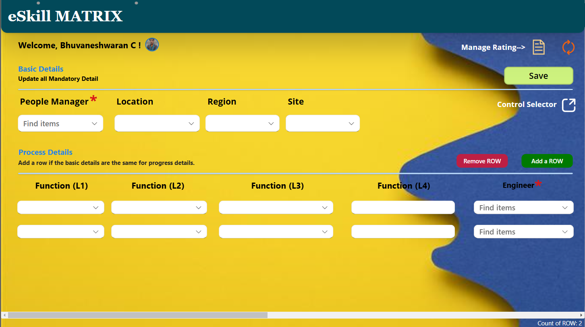
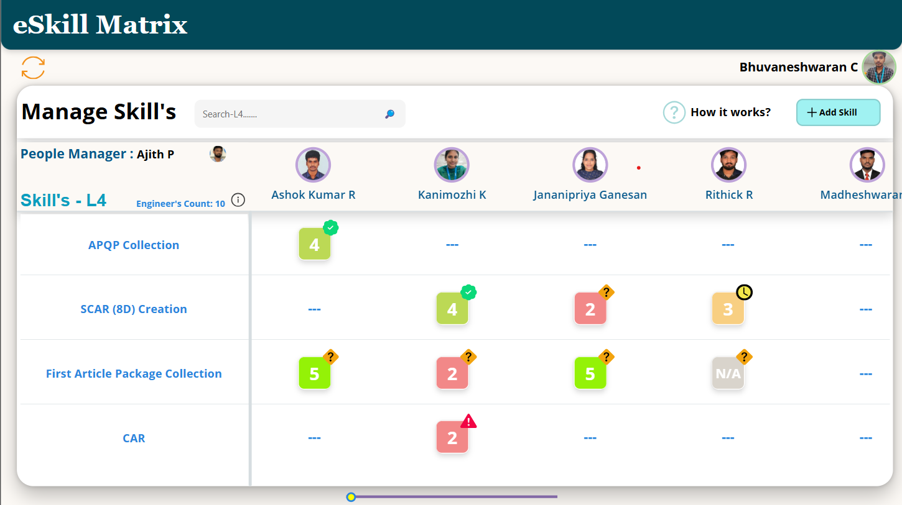
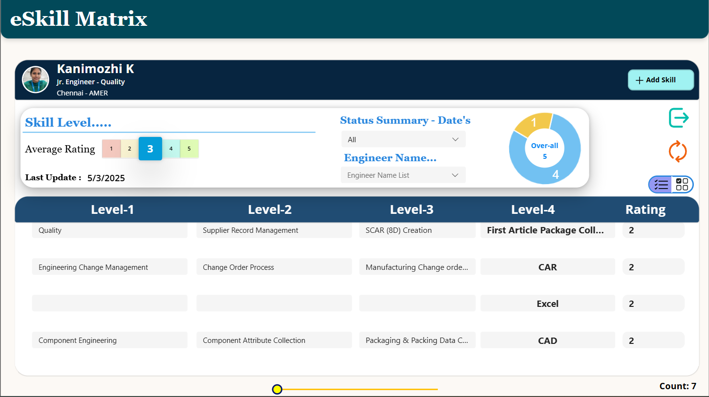

# PowerApps-Skill_matrixtool
The Skill Matrix Management App is a Power Apps tool for tracking employee skills
# Skill Matrix Management App – Power Platform Solution

## 🧩 Overview
The **Skill Matrix Management App** is a custom Power Apps solution designed to efficiently track and manage employee skills, training completion, and role-based competencies. It simplifies data entry, visualization, and reporting for HR and department leads through a highly interactive and user-friendly interface.

## 🚀 Features
- 📋 **Role-Based Access:** Separate views and permissions for Admins, Managers, and Employees.
- 📈 **Interactive Dashboards:** Donut charts and dynamic visuals display skill levels and training status at a glance.
- 🔄 **Cascading Dropdowns:** Dependent dropdowns simplify complex selections (e.g., department → team → skill).
- ➕ **Multi-Row Input Controls:** Add or update multiple skills/training items at once.
- 🔔 **Automated Reminders:** Power Automate flows send scheduled emails for overdue or upcoming training.
- 🖼️ **SVG Icons and Visuals:** Clean UI powered by custom SVGs for clarity and modern design.
- 🧠 **Power Fx Logic:** Business rules and validation logic handled directly in the app using Power Fx.

## 💡 Benefits
- ⏱️ **Saves Time:** Automates skill tracking, minimizing manual record-keeping.
- 📊 **Clear Insights:** Dashboards offer real-time visibility into training and competency gaps.
- 📌 **Better Decisions:** Empowers management with actionable workforce data.
- 🔐 **Secure Access:** Role-based controls ensure data confidentiality and integrity.
- 🧭 **User-Friendly:** Streamlined navigation and responsive design improve user experience.

## 🛠️ Technologies Used
- **Power Apps** (Canvas App)
- **Power Automate**
- **Power Fx**
- **SVG Icons for UI**
- **SharePoint** (as data source)
- **Microsoft Dataverse** (optional, if used)

## 📸 Screenshots

### 🔹 Skill Entry

### 🔹 L4 Skill Rating

### 🔹 Skill Dashboard

## 📦 Business Impact
This app enabled faster tracking of skill readiness across teams and streamlined training compliance. The automated reminders helped reduce overdue training by eliminating manual follow-ups.

---

